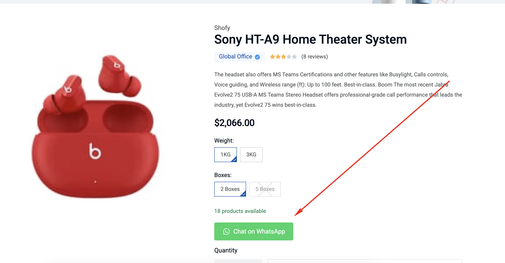
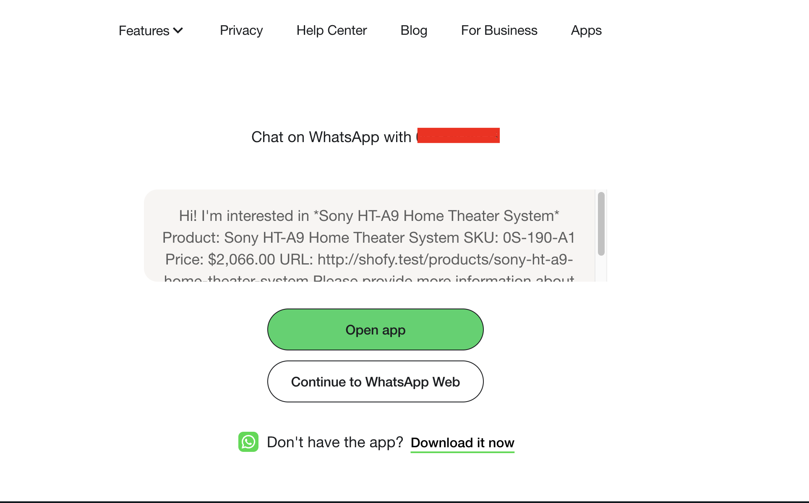
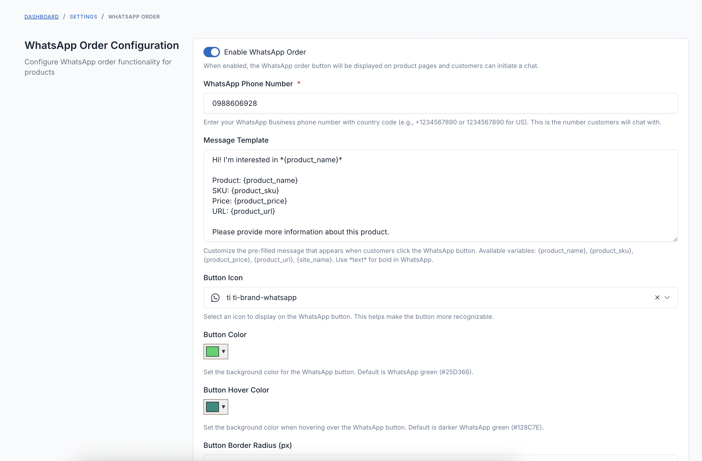

# FOB Product WhatsApp Order

A comprehensive WhatsApp integration plugin for Botble CMS that enables customers to instantly connect with your business via WhatsApp for product inquiries, while providing administrators with powerful customization options to manage the integration effectively.

## Requirements

- Botble core 7.5.0 or higher.
- PHP 8.1 or higher.

## Installation

### Install via Admin Panel

Go to the **Admin Panel** and click on the **Plugins** tab. Click on the "Add new" button, find the **FOB Product WhatsApp Order** plugin and click on the "Install" button.

### Install manually

1. Download the plugin from the [Botble Marketplace](https://marketplace.botble.com/products/friendsofbotble/fob-product-whatsapp-order).
2. Extract the downloaded file and upload the extracted folder to the `platform/plugins` directory.
3. Go to **Admin** > **Plugins** and click on the **Activate** button.

## Features

- **One-Click WhatsApp Chat**: Direct WhatsApp integration for instant customer communication
- **Pre-filled Messages**: Automatically populated messages with product details for context
- **Product Integration**: Seamlessly integrates with existing product pages with customizable button placement
- **Message Templates**: Customizable message templates with dynamic product variables
- **Smart Display Rules**: Control button visibility based on stock status and product settings
- **Customizable Appearance**: Configure button colors, icons, and styling to match your brand
- **Mobile Optimized**: Works seamlessly on both WhatsApp Web and mobile applications
- **Multi-language Support**: Fully translatable for international stores
- **Phone Number Validation**: Built-in validation for international phone numbers
- **Responsive Design**: Works perfectly on desktop, tablet, and mobile devices

## Usage

### For Store Administrators

1. Navigate to **Settings** > **Others** > **WhatsApp Order** to configure the plugin
2. Enter your WhatsApp Business phone number with country code
3. Customize the message template with available variables
4. Configure button appearance and display rules

### For Customers

1. Visit any product page
2. Click the "Chat on WhatsApp" button
3. WhatsApp opens with pre-filled product information
4. Start chatting immediately with your support team

### Configuration Options

Access settings at **Settings** > **Others** > **WhatsApp Order**:

- **Enable/Disable**: Control global visibility of WhatsApp button
- **WhatsApp Number**: Set your WhatsApp Business phone number
- **Message Template**: Customize pre-filled message with variables
- **Button Customization**: Choose icon, colors, and border radius
- **Display Rules**: Show for out-of-stock products or all products
- **Button Colors**: Set primary and hover colors for the button

### Available Message Variables

- `{product_name}` - Product name
- `{product_sku}` - Product SKU
- `{product_price}` - Formatted product price
- `{product_url}` - Direct link to product page
- `{site_name}` - Your website name

## Screenshots

### WhatsApp Button on Product Detail Page

*WhatsApp order button displayed on product detail page*

*Alternative view of WhatsApp button integration*

### Settings Configuration

*Configuration page in Settings > Others > WhatsApp Order*

## Contributing

Please see [CONTRIBUTING](CONTRIBUTING.md) for details.

## Bug Reports

If you discover a bug in this plugin, please [create an issue](https://github.com/FriendsOfBotble/fob-product-whatsapp-order/issues).

## Security

If you discover any security related issues, please email friendsofbotble@gmail.com instead of using the issue tracker.

## Credits

- [Friends Of Botble](https://github.com/FriendsOfBotble)
- [All Contributors](../../contributors)

## License

The MIT License (MIT). Please see [License File](LICENSE) for more information.